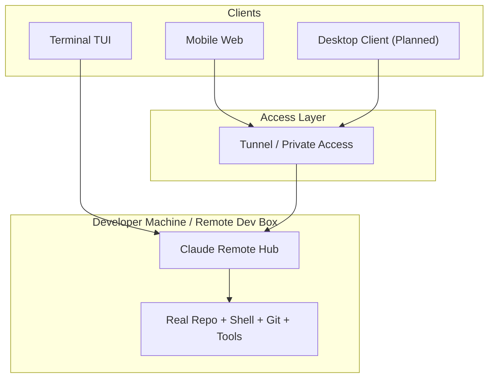
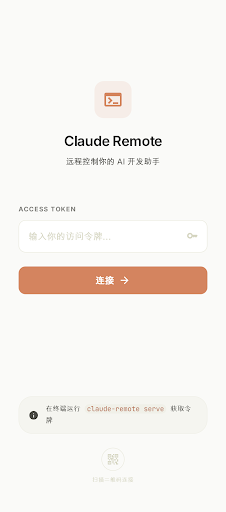
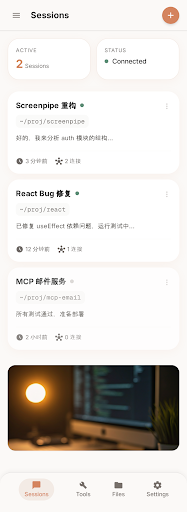
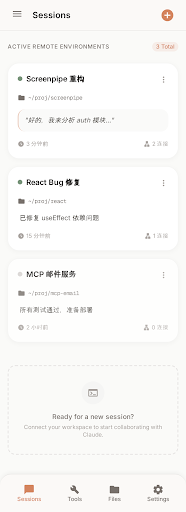
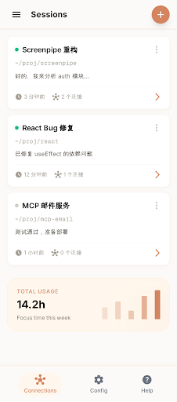
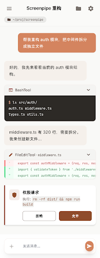
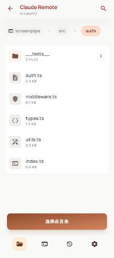
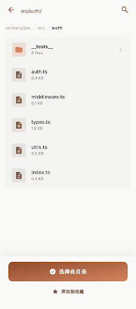
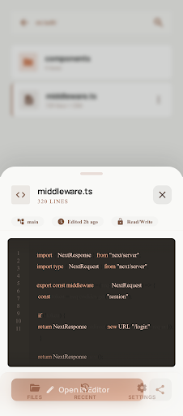

# Claude Remote

> Attach to the AI coding session running on your development machine, instead of opening a second-class remote chat box.

## Why Claude Remote

Claude Remote is aimed at a different problem than a generic web chat wrapper.

- The session should live on the development machine, not in a browser tab.
- The real working directory, shell, git state, tools, MCP config, and local credentials should stay where the code is.
- A phone, terminal, and future desktop client should be able to attach to the same session.
- Disconnecting the client should not kill the development session.

That is what this repo means by "real remote".

For domestic developers using overseas development machines or overseas network egress, this is also a practical setup: the model-facing environment stays on the remote machine, while your phone or local terminal becomes a thin client with near-local workflow continuity.

## Architecture Direction



The intended direction is:

- The hub runs where the code and tools actually live
- Mobile web and future desktop clients attach to the same underlying session
- The desktop plan is to provide a more native, near-local experience without moving execution away from the remote development environment

## Domestic Access Scenario

Claude Remote is not a magic network bypass by itself, but **theoretically it can solve the "domestic device cannot directly use Claude" problem** in a practical way:

- Run Claude Remote on an overseas development machine, overseas VPS, or any environment with stable Claude access
- Keep model calls on that remote environment
- Use your phone, browser, terminal, or future desktop client only as an attached control surface

In that setup, the local device does not need to talk directly to Claude. The remote environment does.

Practical boundary:

- This depends on the remote environment actually being able to access Claude reliably
- This repo does not claim to guarantee legal, policy, or network outcomes
- The benefit comes from moving the AI execution environment, not from bypassing restrictions on the local device itself

## 安全与合规

> **核心原则：融入，不消失。** Claude Remote 不是自动化工具，而是把终端搬到手机上。从服务端视角看，你仍然是一个正常用户在使用 Claude Code。

### 为什么这样设计

| 设计决策 | 安全原因 |
|---|---|
| **直接复用官方 Claude Client** | HTTP Header、User-Agent、指纹头、anti-distillation 头保持一致，服务端看到的请求与正常 CLI 尽量对齐 |
| **遥测不关不改** | 保持默认遥测上报，不设置 `DISABLE_TELEMETRY` 等异常环境变量 |
| **PWA 而非原生 App** | 不额外引入 GPS、SIM、基站等手机硬件级信号 |
| **单账号单设备** | Hub 运行在你自己的开发机上，Device ID 与开发环境保持一致 |
| **人类始终在操作** | 每条消息、每个权限决策都应由真人触发，不是无人值守脚本 |
| **频率控制** | 多 session 并发时需要限流，避免形成异常的自动化调用模式 |

### 环境一致性原则

Hub 设计上应尽量让运行环境与正常本地 CLI 保持一致：

- 使用真实开发机上的工作目录、shell、git、工具链和凭据
- 保持与开发环境一致的时区、语言、系统信息和出口网络
- 不额外篡改官方客户端协议层
- 不通过关闭遥测、伪造设备或批量轮换账号来规避风控

### 使用建议

- 不要关闭遥测
- 不要把它当成无人值守自动化平台
- 不要在单账号上做异常高频、多 session 爆发式调用
- 尽量让部署环境和你声称的使用环境保持一致

更完整的设计约束与实现思路，请参考主设计规格：
[`docs/superpowers/specs/2026-04-01-claude-remote-design.md`](./docs/superpowers/specs/2026-04-01-claude-remote-design.md)

## Current Phase

This repo is currently in **Phase 1: Local Hub Baseline + Contributor Onramp**.

What exists now:

- `claude-remote serve`
- `claude-remote status`
- `claude-remote attach`
- Unix socket local hub transport
- In-memory session registry
- Minimal socket protocol and local hub client

What is intentionally not done yet:

- Hub-backed chat execution
- Web frontend implementation
- SQLite persistence
- Tunnel/auth/web session management
- Full multi-client conflict handling

That means the current goal is not "ship the full product", but "make the architecture and contribution path stable enough that multiple developers can start implementing issues in parallel".

## Contributor Workflow

Current contribution rules:

- Claim work by commenting `/claim` on an issue
- Work one issue per branch and one issue per PR
- Use branch names like `issue-12-local-hub-client`
- Open draft PRs first
- Move issue/project status through the Project Board columns as work progresses

## Quick Start

Requirements:

- Bun `>= 1.2`
- Node.js `>= 18`

Install dependencies:

```bash
bun install
```

Run the current local hub baseline from the repo:

```bash
./bin/claude-remote status
./bin/claude-remote serve
./bin/claude-remote attach
```

Current expected behavior:

- `status` prints local hub state
- `serve` starts the local hub over Unix socket
- `attach` connects to the hub and attaches to a local session

## Specs And Plans

- Main product spec: [`docs/superpowers/specs/2026-04-01-claude-remote-design.md`](./docs/superpowers/specs/2026-04-01-claude-remote-design.md)
- Local baseline spec: [`docs/superpowers/specs/2026-04-01-local-hub-baseline-design.md`](./docs/superpowers/specs/2026-04-01-local-hub-baseline-design.md)
- Local baseline plan: [`docs/superpowers/plans/2026-04-01-local-hub-baseline.md`](./docs/superpowers/plans/2026-04-01-local-hub-baseline.md)

## Design Screens

Stitch project:
[Claude Remote - Mobile Web UI](https://stitch.withgoogle.com/projects/9350772801597042)

Current mobile design screens from Stitch are checked into the repo under [`docs/designs/claude-remote/`](./docs/designs/claude-remote).

| Login | Sessions List | Sessions List |
| --- | --- | --- |
|  |  |  |

| Sessions List | Main Chat | Main Chat |
| --- | --- | --- |
|  |  |  |

| File Browser | File Browser | File Preview |
| --- | --- | --- |
|  |  |  |

## Repo Context

This repository started from the locally-runnable repair work on the leaked Claude Code source tree and is evolving toward a dedicated `claude-remote` product and workflow.

## Disclaimer

This repository is based on the Claude Code source leak that surfaced on 2026-03-31. Original source copyright belongs to Anthropic. This repo is for research and learning purposes.
