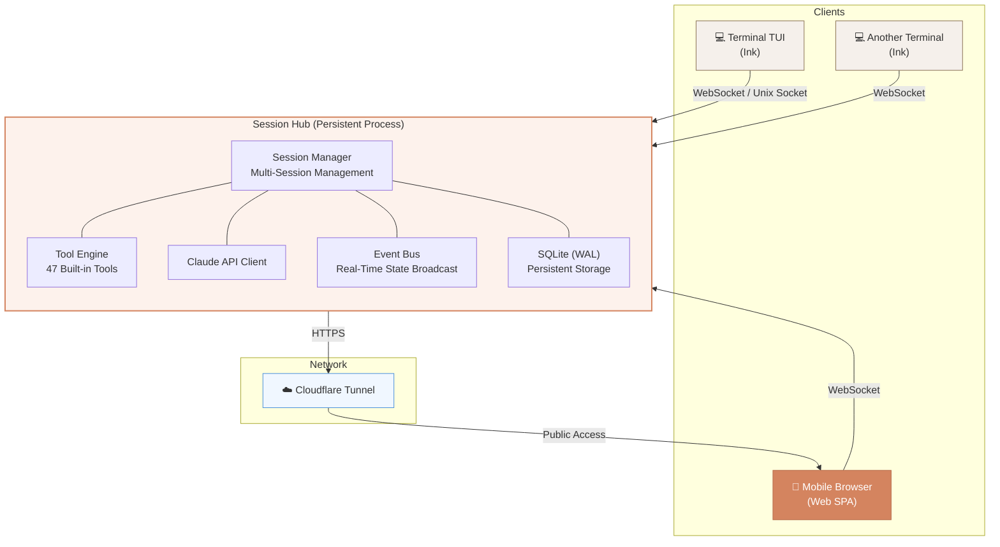

# Claude Remote

> Attach to the AI coding session running on your development machine, instead of opening a second-class remote chat box.

**[中文文档](./README.zh-CN.md)**

## New Contributor Start Here

1. Read [`CONTRIBUTING.md`](./CONTRIBUTING.md)
2. Pick an open issue and comment `/claim`
3. Create a branch named `issue-<number>-<slug>`
4. Open a draft PR when the issue-sized slice is ready

```bash
bun install
./bin/claude-remote status
./bin/claude-remote serve
./bin/claude-remote attach
```

## Core Features

- **Remote Control from Phone** — Full-featured operation from mobile browser, aligned with terminal experience
- **Session Hub Architecture** — Persistent background service, multi-session management, SQLite storage
- **Multi-Client Real-Time Sync** — TUI and Web share sessions, messages/tools/permissions sync in real-time
- **Full Tool Support** — 47 built-in tools, 103+ slash commands, 20 Skills, fully supported on Web
- **PWA Native Experience** — Add to home screen for native app experience, push notifications supported
- **Secure Remote Access** — Cloudflare Tunnel + Token dual-layer authentication
- **Working Directory Management** — Favorite directories + file browser, switch projects from phone

## Tech Stack

| Layer | Technology |
|-------|------------|
| Runtime | [Bun](https://bun.sh) |
| Language | TypeScript |
| Server | Hono.js (HTTP + WebSocket) |
| Frontend | React 19 + Tailwind CSS + Zustand |
| TUI | React + Ink |
| Database | SQLite (WAL mode) |
| Tunnel | Cloudflare Tunnel |

## Why Claude Remote

Claude Remote is aimed at a different problem than a generic web chat wrapper.

- The session should live on the development machine, not in a browser tab.
- The real working directory, shell, git state, tools, MCP config, and local credentials should stay where the code is.
- A phone, terminal, and future desktop client should be able to attach to the same session.
- Disconnecting the client should not kill the development session.

That is what this repo means by "real remote".

For domestic developers using overseas development machines or overseas network egress, this is also a practical setup: the model-facing environment stays on the remote machine, while your phone or local terminal becomes a thin client with near-local workflow continuity.

## Architecture



Key design decisions:

- **Hub is the engine**, clients (TUI / Web) are pure view layers
- Each session has independent AppState + cwd isolation (`AsyncLocalStorage`)
- WebSocket event-driven, SQLite WAL mode persistence
- CLI exit does not affect Hub — phone can continue operating

## Domestic Access Scenario

Claude Remote is not a magic network bypass by itself, but **theoretically it can solve the "domestic device cannot directly use Claude" problem** in a practical way:

- Run Claude Remote on an overseas development machine, overseas VPS, or any environment with stable Claude access
- Keep model calls on that remote environment
- Use your phone, browser, terminal, or future desktop client only as an attached control surface

In that setup, the local device does not need to talk directly to Claude. The remote environment does.

Practical boundary:

- This depends on the remote environment actually being able to access Claude reliably
- This repo does not claim to guarantee legal, policy, or network outcomes
- The benefit comes from moving the AI execution environment, not from bypassing restrictions on the local device itself

## Safety & Compliance

> **Core principle: Blend in, don't disappear.** Claude Remote is not an automation tool — it moves the terminal to your phone. From the server's perspective, you are still a normal user using Claude Code.

### Why It Won't Cause Account Bans

| Design Decision | Safety Reason |
|---|---|
| **Reuse official Claude Client directly** | HTTP Header, User-Agent, fingerprint headers, anti-distillation headers all pass through unchanged |
| **Telemetry untouched** | Default telemetry reporting preserved, no `DISABLE_TELEMETRY` env vars set |
| **PWA instead of native App** | No GPS/SIM/base station hardware signals collected |
| **Single account, single device** | Hub runs on your own dev machine, Device ID unchanged |
| **Human always in control** | Every message sent by human, every permission approved by human |
| **Global rate limiting** | Auto-throttle on concurrent sessions (default max 2 concurrent API calls, 20/min) |

### Technical Detail: How Hub Matches Local CLI

Claude Code uses multi-dimensional signals to detect its runtime environment. Hub as a daemon lacks normal terminal session characteristics. Without patching, the compliance system would see a "non-interactive automation tool" — a high-risk signal.

**Hub automatically executes environment patching (`patchInteractiveEnv`) at startup, eliminating every difference:**

| Signal | Local CLI (normal) | Hub daemon (unpatched) | Hub (patched) |
|---|---|---|---|
| `process.stdout.isTTY` | `true` | `undefined` | `true` |
| `is_interactive` (telemetry) | `true` | `false` | `true` |
| `TERM` | `xterm-256color` | unset | `xterm-256color` |
| `TERM_PROGRAM` | `iTerm2` etc | unset | `xterm` |
| `COLORTERM` | `truecolor` | unset | `truecolor` |
| `COLUMNS` / `LINES` | real size | unset | `120` / `40` |
| API request headers | official Client | same Client | identical |
| Device ID | local machine | same machine | identical |
| Egress IP | local IP | same machine | identical |
| Telemetry data | reports local env | reports same env | identical |

**How it works:** Hub calls `patchInteractiveEnv()` as the **very first line** in `serve.ts`, before any Claude Code module loads. All subsequent detection logic (`detectTerminal()`, telemetry collection, API logging) sees a normal interactive terminal environment.

```
claude-remote serve
    │
    ├─ 1. patchInteractiveEnv()     ← Step 1: Patch TTY + env vars
    ├─ 2. verifyInteractiveEnv()    ← Verify patch is effective
    ├─ 3. Check unsafe env vars     ← Warn about DISABLE_TELEMETRY etc
    └─ 4. Load Claude Code modules  ← All detection logic sees normal env
```

The patch uses `??=` assignment — never overwrites existing values.

### Usage Guidelines

- **Do NOT disable telemetry** — disabling telemetry is the strongest anomaly signal, telling compliance "I have something to hide"
- **Do NOT install the official mobile client** — mobile apps collect GPS/SIM/base station signals that are impossible to mask; PWA is sufficient
- **Do NOT run too many sessions concurrently** — built-in rate limiting provides a safety net, but reasonable usage habits are safer
- **Do NOT call 24/7 non-stop** — maintain normal human usage rhythm
- **Keep environment signals consistent** — timezone (`TZ`), language (`LANG`), egress IP should point to the same compliant region
- **Do NOT use China-specific Linux distros** — deepin/UOS/openKylin distro names are strong geographic signals

See design spec [Section 16: Compliance](./docs/superpowers/specs/2026-04-01-claude-remote-design.md) for full details.

## Current Phase

This repo is currently in **Phase 1: Local Hub Baseline + Contributor Onramp**.

What exists now:

- `claude-remote serve`
- `claude-remote status`
- `claude-remote attach`
- Unix socket local hub transport
- In-memory session registry
- Minimal socket protocol and local hub client

What is intentionally not done yet:

- Hub-backed chat execution
- Web frontend implementation
- SQLite persistence
- Tunnel/auth/web session management
- Full multi-client conflict handling

## Contributor Workflow

- Full workflow: [`CONTRIBUTING.md`](./CONTRIBUTING.md)
- Claim work by commenting `/claim` on an issue
- Work one issue per branch and one issue per PR
- Use branch names like `issue-12-local-hub-client`
- Open draft PRs first

## Quick Start

Requirements: Bun `>= 1.2`, Node.js `>= 18`

```bash
bun install
./bin/claude-remote status
./bin/claude-remote serve
./bin/claude-remote attach
```

## Project Structure

```
src/
├── entrypoints/
│   ├── cli.tsx              # CLI entry point
│   └── serve.ts             # Hub service entry point
├── hub/                     # Hub core
│   ├── Hub.ts               # Hub main class
│   ├── patchInteractiveEnv.ts # Environment patch (daemon vs terminal gap)
│   ├── SessionManager.ts    # Session CRUD + state management
│   ├── EventBus.ts          # Event broadcast system
│   ├── ToolEngine.ts        # Tool execution engine
│   └── store/SqliteStore.ts # SQLite persistence
├── server/                  # HTTP/WS server
│   ├── routes/              # REST API
│   ├── ws/                  # WebSocket protocol
│   └── auth/                # Token authentication
├── web/                     # Web frontend SPA
│   ├── pages/               # Login, Sessions, Chat, Files
│   └── components/          # UI components
├── shared/                  # Shared types (frontend + backend)
├── tunnel/                  # Cloudflare Tunnel management
├── screens/REPL.tsx         # TUI interactive interface
├── tools/                   # 47 built-in tools
├── commands/                # 103+ slash commands
├── skills/                  # 20 Skills
└── services/                # API, MCP, OAuth service layer
```

## Specs & Plans

- Main product spec: [`docs/superpowers/specs/2026-04-01-claude-remote-design.md`](./docs/superpowers/specs/2026-04-01-claude-remote-design.md)
- Local baseline spec: [`docs/superpowers/specs/2026-04-01-local-hub-baseline-design.md`](./docs/superpowers/specs/2026-04-01-local-hub-baseline-design.md)
- Local baseline plan: [`docs/superpowers/plans/2026-04-01-local-hub-baseline.md`](./docs/superpowers/plans/2026-04-01-local-hub-baseline.md)

## Design Screens

Stitch project: [Claude Remote - Mobile Web UI](https://stitch.withgoogle.com/projects/9350772801597042)

Design screens are checked into [`docs/designs/claude-remote/`](./docs/designs/claude-remote).

| Login | Sessions List | Sessions List |
| --- | --- | --- |
|  |  |  |

| Sessions List | Main Chat | Main Chat |
| --- | --- | --- |
|  |  |  |

| File Browser | File Browser | File Preview |
| --- | --- | --- |
|  |  |  |

## Repo Context

This repository started from the locally-runnable repair work on the leaked Claude Code source tree and is evolving toward a dedicated `claude-remote` product and workflow.

## Disclaimer

This repository is based on the Claude Code source leak that surfaced on 2026-03-31. Original source copyright belongs to [Anthropic](https://www.anthropic.com). For research and learning purposes only.
