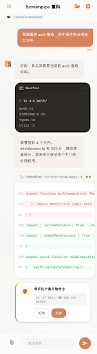
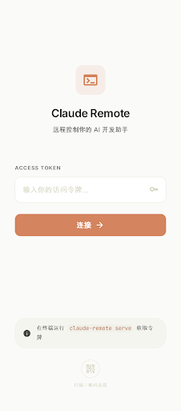
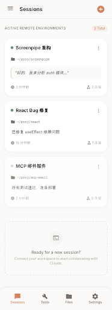

# Claude Remote

> 将 Claude Code CLI 升级为可远程控制的 AI 开发服务，手机浏览器即可全功能操作。

<p align="center">
  
</p>

## 核心特性

- **手机远程控制** — 手机浏览器全功能操作，与终端体验对齐
- **Session Hub 架构** — 常驻后台服务，多 session 管理，持久化存储
- **多端实时同步** — TUI 和 Web 共享 session，消息/工具/权限实时同步
- **工具全功能** — 47 个内置工具、103+ 斜杠命令、20 个 Skills，Web 端完整支持
- **安全远程访问** — Cloudflare Tunnel + Token 双层认证
- **工作目录管理** — 收藏目录 + 文件浏览器，手机上自由切换项目

## UI 设计稿

Claude 风格的温暖赭石色调，移动优先设计：

<table>
  <tr>
    <td align="center" width="33%"><br><b>Login 登录页</b></td>
    <td align="center" width="33%"><br><b>Sessions 列表</b></td>
    <td align="center" width="33%"><br><b>Chat 主界面</b></td>
  </tr>
</table>

## 架构

```
┌─────────────┐     ┌─────────────┐     ┌──────────────┐
│  手机浏览器   │     │  终端 TUI    │     │  另一个终端   │
│  (Web SPA)  │     │  (Ink)      │     │  (Ink)       │
└──────┬──────┘     └──────┬──────┘     └──────┬───────┘
       │ WebSocket         │ WebSocket         │
       ▼                   ▼                   ▼
┌──────────────────────────────────────────────────────┐
│                   Session Hub（常驻进程）               │
│                                                      │
│  Tool Engine · Claude API · SQLite · Event Bus       │
│  Hono HTTP/WS Server (:3456)                        │
└──────────────────────────────────────────────────────┘
       │
  Cloudflare Tunnel → 公网访问
```

**关键设计：**
- Hub 是引擎，客户端（TUI/Web）是纯视图层
- 每个 Session 独立 AppState + cwd 隔离（`AsyncLocalStorage`）
- WebSocket 事件驱动，SQLite WAL 模式持久化
- CLI 退出不影响 Hub，手机可继续操作

## 技术栈

| 层级 | 技术 |
|------|------|
| 运行时 | [Bun](https://bun.sh) |
| 语言 | TypeScript |
| 服务端 | Hono.js（HTTP + WebSocket） |
| 前端 | React 19 + Tailwind CSS + Zustand |
| TUI | React + Ink |
| 数据库 | SQLite（WAL 模式） |
| 隧道 | Cloudflare Tunnel |

## 快速开始

### 1. 安装依赖

需要 [Bun](https://bun.sh) >= 1.1 和 Node.js >= 18。

```bash
npm install
```

### 2. 配置环境变量

```bash
cp .env.example .env
```

编辑 `.env`：

```env
# API 认证（二选一）
ANTHROPIC_API_KEY=sk-xxx
ANTHROPIC_AUTH_TOKEN=sk-xxx

# API 端点（可选）
ANTHROPIC_BASE_URL=https://api.minimaxi.com/anthropic

# 模型配置
ANTHROPIC_MODEL=MiniMax-M2.7-highspeed
```

### 3. 启动

```bash
# 启动 Hub 服务（后台常驻）
claude-remote serve --tunnel

# 终端连接 Hub
claude-remote attach

# 传统 TUI 模式（无 Hub）
./bin/claude-haha

# 无头模式
./bin/claude-haha -p "your prompt here"
```

启动后终端会打印公网 URL + QR Code，手机扫码即可访问。

## 项目结构

```
src/
├── entrypoints/
│   ├── cli.tsx              # CLI 主入口
│   └── serve.ts             # Hub 服务入口（新增）
├── hub/                     # Session Hub 核心（新增）
│   ├── Hub.ts               # Hub 主类
│   ├── SessionManager.ts    # Session CRUD + 状态管理
│   ├── EventBus.ts          # 事件广播系统
│   ├── ToolEngine.ts        # Tool 执行引擎
│   └── store/SqliteStore.ts # SQLite 持久化
├── server/                  # HTTP/WS 服务（新增）
│   ├── routes/              # REST API
│   ├── ws/                  # WebSocket 协议
│   └── auth/                # Token 认证
├── web/                     # Web 前端 SPA（新增）
│   ├── pages/               # Login, Sessions, Chat, Files
│   └── components/          # UI 组件
├── shared/                  # 前后端共享类型（新增）
├── tunnel/                  # Cloudflare Tunnel 管理（新增）
├── screens/REPL.tsx         # TUI 交互界面
├── tools/                   # 47 个内置工具
├── commands/                # 103+ 斜杠命令
├── skills/                  # 20 个 Skills
└── services/                # API, MCP, OAuth 等服务层
```

## 设计文档

详细设计规格：[`docs/superpowers/specs/2026-04-01-claude-remote-design.md`](docs/superpowers/specs/2026-04-01-claude-remote-design.md)

## 基础项目

基于 Claude Code 泄露源码修复的本地可运行版本。原始修复详见 [claude-code-haha](https://github.com/NanmiCoder/claude-code-haha)。

## Disclaimer

本仓库基于 2026-03-31 从 Anthropic npm registry 泄露的 Claude Code 源码。所有原始源码版权归 [Anthropic](https://www.anthropic.com) 所有。仅供学习和研究用途。
