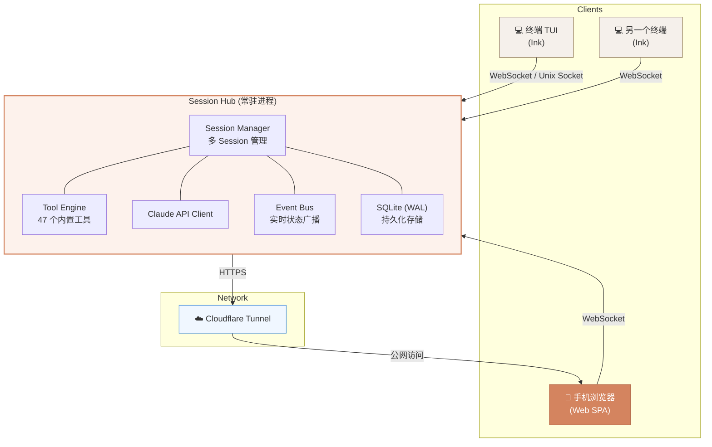

# Claude Remote

> 将 Claude Code CLI 升级为可远程控制的 AI 开发服务，手机浏览器即可全功能操作。

<p align="center">
  
</p>

## 核心特性

- **手机远程控制** — 手机浏览器全功能操作，与终端体验对齐
- **Session Hub 架构** — 常驻后台服务，多 session 管理，持久化存储
- **多端实时同步** — TUI 和 Web 共享 session，消息/工具/权限实时同步
- **工具全功能** — 47 个内置工具、103+ 斜杠命令、20 个 Skills，Web 端完整支持
- **PWA 原生体验** — 添加到主屏幕即像原生 App，支持推送通知
- **安全远程访问** — Cloudflare Tunnel + Token 双层认证
- **工作目录管理** — 收藏目录 + 文件浏览器，手机上自由切换项目

## UI 设计稿

Claude 风格的温暖赭石色调，移动优先设计：

<table>
  <tr>
    <td align="center" width="33%"><br><b>Login 登录页</b></td>
    <td align="center" width="33%"><br><b>Sessions 列表</b></td>
    <td align="center" width="33%"><br><b>Chat 主界面</b></td>
  </tr>
</table>

## 架构



**关键设计：**
- **Hub 是引擎**，客户端（TUI / Web）是纯视图层
- 每个 Session 独立 AppState + cwd 隔离（`AsyncLocalStorage`）
- WebSocket 事件驱动，SQLite WAL 模式持久化
- CLI 退出不影响 Hub，手机可继续操作

## 技术栈

| 层级 | 技术 |
|------|------|
| 运行时 | [Bun](https://bun.sh) |
| 语言 | TypeScript |
| 服务端 | Hono.js（HTTP + WebSocket） |
| 前端 | React 19 + Tailwind CSS + Zustand |
| TUI | React + Ink |
| 数据库 | SQLite（WAL 模式） |
| 隧道 | Cloudflare Tunnel |

## 快速开始

### 1. 安装依赖

需要 [Bun](https://bun.sh) >= 1.1 和 Node.js >= 18。

```bash
npm install
```

### 2. 配置环境变量

```bash
cp .env.example .env
```

编辑 `.env`：

```env
# API 认证（二选一）
ANTHROPIC_API_KEY=sk-xxx
ANTHROPIC_AUTH_TOKEN=sk-xxx

# API 端点（可选）
ANTHROPIC_BASE_URL=https://api.minimaxi.com/anthropic

# 模型配置
ANTHROPIC_MODEL=MiniMax-M2.7-highspeed
```

### 3. 启动

```bash
# 启动 Hub 服务（后台常驻）
claude-remote serve --tunnel

# 终端连接 Hub
claude-remote attach

# 传统 TUI 模式（无 Hub）
claude-remote

# 无头模式
claude-remote -p "your prompt here"
```

启动后终端会打印公网 URL + QR Code，手机扫码即可访问。

## 项目结构

```
src/
├── entrypoints/
│   ├── cli.tsx              # CLI 主入口
│   └── serve.ts             # Hub 服务入口（新增）
├── hub/                     # Session Hub 核心（新增）
│   ├── Hub.ts               # Hub 主类
│   ├── SessionManager.ts    # Session CRUD + 状态管理
│   ├── EventBus.ts          # 事件广播系统
│   ├── ToolEngine.ts        # Tool 执行引擎
│   └── store/SqliteStore.ts # SQLite 持久化
├── server/                  # HTTP/WS 服务（新增）
│   ├── routes/              # REST API
│   ├── ws/                  # WebSocket 协议
│   └── auth/                # Token 认证
├── web/                     # Web 前端 SPA（新增）
│   ├── pages/               # Login, Sessions, Chat, Files
│   └── components/          # UI 组件
├── shared/                  # 前后端共享类型（新增）
├── tunnel/                  # Cloudflare Tunnel 管理（新增）
├── screens/REPL.tsx         # TUI 交互界面
├── tools/                   # 47 个内置工具
├── commands/                # 103+ 斜杠命令
├── skills/                  # 20 个 Skills
└── services/                # API, MCP, OAuth 等服务层
```

## 安全与合规

> **核心原则：融入，不消失。** Claude Remote 不是自动化工具，而是把终端搬到手机上——从服务端视角看，你就是一个正常用户在用 Claude Code。

### 为什么不会导致封号

| 设计决策 | 安全原因 |
|---|---|
| **直接复用官方 Claude Client** | HTTP Header、User-Agent、指纹头、anti-distillation 头全部原样透传，服务端看到的请求与正常 CLI 完全一致 |
| **遥测不关不改** | 保持默认遥测上报，不设置任何 `DISABLE_TELEMETRY` 等环境变量。关闭遥测本身是最强的异常信号 |
| **PWA 而非原生 App** | 不采集 GPS/SIM 卡/基站等硬件级地理信号，比安装官方手机客户端更安全 |
| **单账号单设备** | Hub 运行在你自己的开发机上，Device ID 不变，不存在账号共享 |
| **人类始终在操作** | 每条消息是人发的、每个权限是人批的，不是无人值守的自动化脚本 |
| **全局频率控制** | 多 session 并发时自动限流（默认最多 2 个并发 API 调用、每分钟 20 次），防止触发自动化检测 |

### 技术原理：Hub 如何做到与本地 CLI 完全一致

Claude Code 通过多维信号判断运行环境。Hub 作为守护进程启动时，缺少正常终端会话的特征。如果不处理，风控系统会看到一个"非交互式自动化工具"——这是高风险信号。

**Hub 启动时自动执行环境补丁（`patchInteractiveEnv`），逐项消除差异：**

| 信号 | 本地 CLI（正常） | Hub 守护进程（未修复） | Hub（修复后） |
|---|---|---|---|
| `process.stdout.isTTY` | `true` | `undefined` | `true` |
| `is_interactive`（遥测字段） | `true` | `false` | `true` |
| `TERM` | `xterm-256color` | 未设置 | `xterm-256color` |
| `TERM_PROGRAM` | `iTerm2` 等 | 未设置 | `xterm` |
| `COLORTERM` | `truecolor` | 未设置 | `truecolor` |
| `COLUMNS` / `LINES` | 真实窗口尺寸 | 未设置 | `120` / `40` |
| API 请求 Header | 官方 Client | 同一个 Client | 完全一致 |
| Device ID | 本机生成 | 同一台机器 | 完全一致 |
| 出口 IP | 本机 IP | 同一台机器 | 完全一致 |
| 遥测数据 | 上报本机环境 | 上报同一台机器环境 | 完全一致 |

**核心逻辑：** Hub 在 `serve.ts` 入口的**第一行**就调用 `patchInteractiveEnv()`，在任何 Claude Code 模块加载之前完成环境补丁。后续所有检测逻辑（`detectTerminal()`、遥测采集、API 日志）看到的都是正常的交互式终端环境。

```
claude-remote serve
    │
    ├─ 1. patchInteractiveEnv()     ← 第一步：补丁 TTY + 环境变量
    ├─ 2. verifyInteractiveEnv()    ← 验证补丁生效
    ├─ 3. 检查不安全环境变量          ← 警告 DISABLE_TELEMETRY 等
    └─ 4. 加载 Claude Code 模块      ← 此时所有检测逻辑看到正常环境
```

**补丁不覆盖用户已有值**（使用 `??=` 赋值），如果你的机器上已设置了 `TERM`，补丁会保留你的值。

**不需要伪装的部分**（天然一致）：Hub 就运行在你的开发机上，所以 Device ID、IP 地址、OAuth Token、遥测采集的系统信息都与本地 CLI 完全相同——因为它们就是同一台机器。

### 使用建议

- **不要关闭遥测** — 关闭遥测等于告诉风控系统"我有东西要藏"，是最危险的操作
- **不要安装官方手机客户端** — 手机 App 会采集 GPS/SIM/基站等无法伪装的硬件信号，用 PWA 就够了
- **不要同时跑太多 session** — 内置频率控制会兜底，但保持合理使用习惯更安全
- **不要 24 小时无间断调用** — 保持正常的人类使用节奏
- **环境信号保持一致** — 时区（`TZ`）、语言（`LANG`）、IP 出口地理位置应指向同一个合规地区
- **不要使用中国特有 Linux 发行版** — deepin/UOS/openKylin 等发行版名称本身就是强地理信号

详见设计规格 [Section 16: 合规与防封号](docs/superpowers/specs/2026-04-01-claude-remote-design.md#16-合规与防封号)。

## 设计文档

详细设计规格：[`docs/superpowers/specs/2026-04-01-claude-remote-design.md`](docs/superpowers/specs/2026-04-01-claude-remote-design.md)

## 基础项目

基于 Claude Code 泄露源码修复的本地可运行版本。原始修复详见 [claude-code-haha](https://github.com/NanmiCoder/claude-code-haha)。

## Disclaimer

本仓库基于 2026-03-31 从 Anthropic npm registry 泄露的 Claude Code 源码。所有原始源码版权归 [Anthropic](https://www.anthropic.com) 所有。仅供学习和研究用途。
